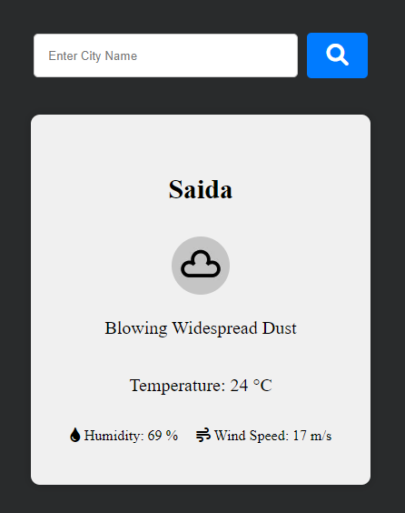

# Weather App



## Description

The Weather App is a simple web application that allows users to check the current weather conditions for their location or any city around the world. It leverages the Weatherstack API to provide real-time weather data, including temperature, humidity, and wind speed. This project aims to offer a user-friendly interface for accessing weather information effortlessly.

## Table of Contents

- [Installation](#installation)
- [Usage](#usage)

## Installation

To run the Weather App locally, follow these steps:

1. Clone the repository to your local machine:

   ```bash
   git clone https://github.com/RamezCh/Weather-App.git

2. Navigate to the project directory:

   ```bash
   cd Weather-App

3. Install the project dependencies using npm:

    ```bash
    npm install

4. Obtain an API key from Weatherstack and replace yourAPIKey in app.js with your actual API key.

5. Start the application:
    ```bash
    npm start

6. Open your web browser and visit http://localhost:3000 to use the Weather App.

## Usage

To use the Weather App:

1. Enter a city name in the search bar and click the search button to fetch the current weather information for that city.
2. The Weather App will display the following information:
   - City name
   - Weather description
   - Temperature in Celsius
   - Humidity percentage
   - Wind speed in meters per second.
3. The weather icon corresponding to the current conditions is also displayed.
